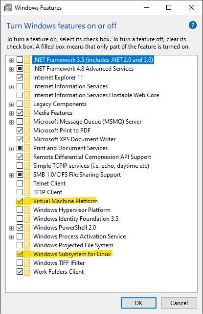

# Windows Pre-requisites
<!-- markdownlint-disable MD031 -->
Please check all of these carefully. In case of emergency read what to do if
[it all goes wrong](#iagw).

**IMPORTANT** The instructions ask you to install docker desktop. This is the
easiest way to get docker and to see your images and containers. This may
also require a paid license. If this is a problem, please see

> [how install docker without installing docker desktop](https://dev.to/felipecrs/simply-run-docker-on-wsl2-3o8)

## Start here

1. You must be running Windows 10 or Windows 11
2. Press the Windows key, type `windows features` then click on the icon.
   Ensure that **`Virtual Machine Platform`** and **`Windows Subsystem for
   Linux`** are both checked as shown in the image below. If you have to check
   either box, then it's REALLY important that your machine reboots after
   installation before proceeding to the next step.<br>
   
3. You must have WSL2 (Windows subsystem for Linux) installed. Press the
   Windows key & type `cmd`. Right click on the `cmd` icon and select `run as
   administrator`. This is really important - installation will fail if you run
   it as a regular user.
4. In the `cmd` window type `wsl -l -v` and choose one of the bullets below
   based on what you see on the screen:
    * **SUCCESS**  - you should see something like this - go to the next step.
      ```text
          C:\Users\bruce>wsl -l -v
            NAME                   STATE           VERSION
          * Debian                 Running         2
            Ubuntu                 Stopped         2
            docker-desktop-data    Running         2
            docker-desktop         Running         2
      ```
    * **help options for wsl are displayed**.<br>
      `wsl` is not fully installed. execute this command:
      ```bat
      wsl --install --no-distribution
      ```
      When installation is complete retype `wsl -l -v` and choose an option.
    * **wsl command not found**.<br>
      Your version of windows is old: follow [these instructions from
      Microsoft](https://learn.microsoft.com/en-us/windows/wsl/install)
    * **No distributions**.<br>
      if no distributions were found, go to the microsoft store and install
      either **debian** or **ubuntu**. Debian is lighter weight and takes less
      space. Ubuntu has more friendly tools and more google hits when searching
      for help. Instalation can also be done in the window that you have open.
      Choose one of these... and then type `exit` once you have chosen a linux
      username, password and seen the linux command prompt appear.
         * `wsl --install Debian`
         * `wsl --install ubuntu`
    * if your windows system reports **version 1** for distributions then I
      strongly recommend running
      ```bat
      wsl --update  --no-distribution
      ```
       to get wsl version 2 so that docker works correctly. You can then
      update specific distributions, for example:
      ```bat
      wsl --set-version Debian 2
      ```
      Full [upgrade instructions at Microsoft](https://learn.microsoft.com/en-us/windows/wsl/install#upgrade-version-from-wsl-1-to-wsl-2)
5. Close the `cmd` window
6. Install [Docker desktop](https://docs.docker.com/desktop/install/windows-install/)

Return to [run instructions](docker-run.md)

___

<a id="iagw"></a>

## It's all gone wrong in Windows

If it all goes wrong, then it's best to start again. The problem might be that
your `cmd` window wasn't run in Administrator mode, maybe you ran out of disc
space or a Windows Update was pending and interfered with the process.

To reset everything:

1. Close all windows and running applications (except your security software)
2. Press the Windows key, type `windows features` then click on the icon.
   Uncheck **`Virtual Machine Platform`** and **`Windows Subsystem for
   Linux`**. Click OK and wit for the machine to reboot. Restart the process
   at the top of the page.<br>
   
